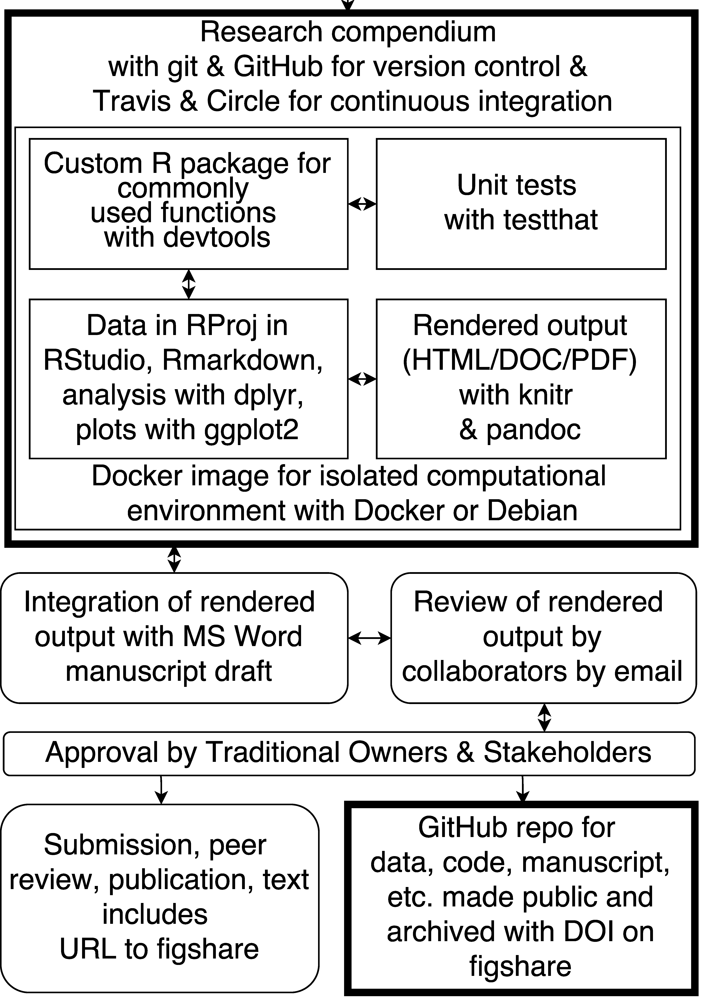

## Introduction 

  - From closet curiosity to debilitating obsession
  - From disgruntled reviewer to interest group organiser

---
layout: false

.left-column[
  #### Introduction
  ### Tools
]

.right-column[

]
---
layout: false

.left-column[
  #### Introduction
  ### Tools
]

.right-column[

]

---
layout: false

.left-column[
  #### Introduction
  ### Tools
]

.right-column[

]

---
layout: false

.left-column[
  ### Introduction
  ### Tools
  ## Pain points
]

.right-column[

- Other people     

- Dependencies on R packages    

- Packrat & MRAN  

]

---

layout: false

.left-column[
  ### Introduction
  ### Tools
  ### Pain points
  ## Challenges going forward
]

.right-column[

- Diffuision into teaching

- Building the Interest Group

- Influencing scholarly publication

]

---

---

## Colophon

Presentation written in [R Markdown](http://rmarkdown.rstudio.com/)

Compiled into HTML5 using [RStudio](http://www.rstudio.com/ide/) & [knitr](http://yihui.name/knitr)

Source code hosting:
<https://github.com/benmarwick/bids-book-lightning>

ORCID: <http://orcid.org/0000-0001-7879-4531>

Licensing: 

* Presentation: [CC-BY-3.0](http://creativecommons.org/licenses/by/3.0/us/)

* Source code: [MIT](http://opensource.org/licenses/MIT) 
